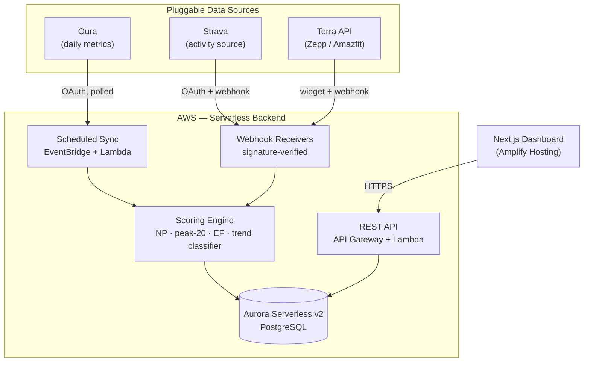

<div align="center">
# Readiness Dashboard
 
**Power:HR efficiency trends vs. recovery data — telling true fitness gains apart from fatigue, earlier than power and hours alone.**
 
[](#roadmap)
[](#license)
[](#tech-stack)
[](#tech-stack)
[](#tech-stack)
[](#tech-stack)
[](#tech-stack)
 
</div>
---
 
## The idea
 
Most "readiness" tools estimate fatigue from training hours and power output alone. That misses the signal that actually separates fitness from fatigue: **how much heart rate a given power output costs you, and how that cost is trending.**
 
This project computes **Efficiency Factor (EF)** — normalized power and peak-20-minute power, each divided by the heart rate during that exact effort — from every qualifying ride, then tracks how that ratio moves relative to resting heart rate and HRV. Crossing those two trends against each other separates four distinct states:
 
| EF trend | Recovery trend | State | Meaning |
|:---:|:---:|---|---|
| ↑ | stable / ↑ | 🟢 **Fitness gain** | More power per heartbeat, well recovered — the real thing. |
| ↑ | ↓ | 🟠 **Overreaching risk** | Output still improving, but at rising physiological cost — the pattern that precedes a crash, and the one hours/power alone can't see. |
| ↓ | ↓ | 🔴 **Acute fatigue** | Correlated, expected fatigue — recovery time should help. |
| ↓ | stable / ↑ | ⚪ **Ambiguous** | No matching recovery signal — heat, pacing, altitude, or illness not yet reflected. Flagged for review, not auto-labeled. |
 
The goal is to see the **overreaching** case — and the days recovery actually paid off — before they show up as a bad race or a missed block.
 
---
 
## Architecture
 

 
Every provider is normalized through a common adapter interface before it ever touches the scoring engine — the engine has no idea whether a day's HRV came from Oura or a ride's power came from Strava. That's what lets new sources (Garmin, Whoop, a manual upload) get added later as a registered adapter, not a schema change.
 
---
 
## Features
 
- **Power:HR decoupling engine** — normalized power + peak-20-minute power computed from raw activity streams, each paired with heart rate over the *same* window, not the ride average.
- **Fatigue vs. fitness classification** — rolling 7-day/28-day trend baselines cross EF against HRV/resting HR into a labeled state, not just a raw number.
- **Pluggable connections** — pick one active activity source and one-or-more daily-metrics sources per user; adding a new provider is a new adapter, not a rework.
- **Multi-user with a coach view** — a `master` role sees a full roster and can drill into any connected athlete.
- **Derive-then-discard storage** — raw streams and payloads are processed into scalars and dropped, not retained; a `derivation_version` on every row means re-deriving after an algorithm change is a targeted, bounded operation, not a standing cost.
- **Security-conscious by default** — OAuth tokens encrypted at rest, every third-party webhook signature-verified before processing, per-user data export/delete built in from day one.
---
 
## Product Perspective
 
*A few questions I ask myself as the product owner, not just the engineer, as this moves past the first build.*
 
> **Who is this actually for?**
> Not casual fitness trackers — athletes who already train with power and HR data and already own a recovery wearable, but whose current tools (Strava, the Oura app, TrainingPeaks) don't cross-reference the two. Primary segment: structured-training cyclists and triathletes coached or self-coached at a competitive-amateur level. Secondary segment: coaches managing several athletes at once — the `master` role exists because I'm a USA Cycling–certified coach and built this for a problem I actually have, not a hypothetical one.
 
> **Where does the first real feedback come from?**
> My own AchievePTC athletes are the first cohort — a built-in, trust-already-established beta group rather than a cold launch. The test that matters isn't a star rating, it's narrower: does the `overreaching_risk` flag show up *before* an athlete or I would have caught it by feel, and does it ever fire when an experienced coach would clearly call it noise? Early feedback will focus on calibrating the EF trend thresholds (§17 in `PLAN.md`) against that judgment, plus a lightweight thumbs-up/down on individual flagged insights to build a signal for recalibration over time.
 
> **What does scaling actually look like, beyond more AWS capacity?**
> Three stages, each unlocked by validating the one before it: **(1)** today — 10 of my own athletes plus myself as coach, proving the core insight holds up against real coaching judgment; **(2)** AchievePTC's other coaches onboarded as their own `master` users over their own rosters — the multi-tenant schema in `PLAN.md` §14 was built with this specific next step in mind, so it's a data-volume change, not a rearchitecture; **(3)** beyond AchievePTC, to other independent coaches and small coaching businesses who have the same gap in their current toolchain. The infrastructure plan was chosen specifically so stage 3 doesn't require revisiting stage 1's decisions.
 
---
 
## Tech Stack
 
| Layer | Choice |
|---|---|
| Frontend | Next.js (App Router), React, TypeScript, Tailwind CSS, Recharts |
| Backend | Node.js, Express (Lambda via `serverless-http`), TypeScript |
| Database | PostgreSQL — Aurora Serverless v2 |
| Infra | AWS: API Gateway, Lambda, EventBridge, Amplify Hosting, Secrets Manager, KMS, CDK |
| Testing | Playwright (e2e), Vitest (unit — scoring engine is the priority target) |
| CI/CD | GitHub Actions |
 
## Data Sources
 
| Role | Current providers | Connection model |
|---|---|---|
| Activity source *(pick one)* | [Strava](https://developers.strava.com/) | OAuth2 + webhook, stream-derived metrics |
| Daily metrics source *(pick one or more)* | [Oura](https://cloud.ouraring.com/v2/docs), Zepp / Amazfit via [Terra](https://tryterra.co/) | OAuth2 (Oura) / widget + webhook (Terra) |
 
Multiple daily-metrics sources can be active at once; an explicit per-metric priority decides which value wins when more than one reports for the same day.
 
---
 
## Getting Started
 
> Auth, the connection framework, and the fatigue/fitness classifier are built; provider integrations (Phase 3–4) and the dashboard UI (Phase 6) are still in progress — see [Roadmap](#roadmap) for current status.
 
### Prerequisites
 
- Node.js 20+
- A PostgreSQL instance (local Docker container for dev; Aurora Serverless v2 in deployed environments)
- Developer credentials for whichever providers you're connecting: [Strava API](https://developers.strava.com/), [Oura API](https://cloud.ouraring.com/oauth/applications), [Terra API](https://dashboard.tryterra.co/)
- AWS CLI configured, if deploying
### Install
 
```bash
git clone https://github.com/quinnFelton/readiness-dashboard.git
cd readiness-dashboard
npm install
```
 
### Configure
 
Copy the example environment file and fill in your provider credentials:
 
```bash
cp .env.example .env
```
 
| Variable | Purpose |
|---|---|
| `DATABASE_URL` | Postgres connection string |
| `STRAVA_CLIENT_ID` / `STRAVA_CLIENT_SECRET` | Strava OAuth app credentials |
| `OURA_CLIENT_ID` / `OURA_CLIENT_SECRET` | Oura OAuth app credentials |
| `TERRA_DEV_ID` / `TERRA_API_KEY` / `TERRA_SIGNING_SECRET` | Terra dashboard credentials + webhook signing secret |
| `TOKEN_ENCRYPTION_KEY` | Local-dev stand-in for the KMS key used to encrypt stored OAuth tokens |
| `NEXTAUTH_SECRET` | App-level session signing secret |
 
### Run
 
```bash
npm run dev       # frontend + backend in watch mode
npm run test       # Vitest unit suite (scoring engine fixtures)
npm run test:e2e    # Playwright end-to-end suite
```
 
---
 
## Project Structure
 
```
readiness-dashboard/
├─ apps/
│  ├─ web/                  # Next.js dashboard
│  └─ api/                  # Express backend (Lambda-wrapped)
├─ packages/
│  ├─ shared-types/          # Normalized data contracts shared by web + api
│  ├─ scoring-engine/         # Pure-function NP / peak-20 / EF / trend classifier — unit-tested standalone
│  └─ provider-adapters/       # oura.ts · strava.ts · terra.ts — one interface per connection role
├─ infra/
│  └─ cdk/                    # AWS infrastructure as code
├─ tests/
│  └─ e2e/                    # Playwright specs
├─ CLAUDE.md                  # Build instructions for AI-assisted development
└─ PLAN.md                    # Full technical spec — schema, algorithms, phased build plan
```
 
For the full data model, the EF/NP derivation math, and the phase-by-phase build plan, see **[`PLAN.md`](./PLAN.md)**.
 
---
 
## Roadmap
 
Phases 1, 2, and 5 were built first and independently of the rest — none of them need a live provider connection to build or test against (auth and the connection framework run against seeded/mock data; the classifier runs against synthetic fixtures, per `PLAN.md` §8.5), so they didn't need to wait on Strava/Oura/Terra integration work.
 
- [x] **Phase 0** — Monorepo scaffolding, CI skeleton
- [x] **Phase 1** — Auth & user model (user / master roles)
- [x] **Phase 2** — Pluggable connection framework
- [ ] **Phase 3** — Oura + Terra (Zepp/Amazfit) daily-metrics integrations
- [ ] **Phase 4** — Strava integration + activity stream derivation (NP, peak-20, EF)
- [x] **Phase 5** — Fatigue/fitness trend classifier
- [ ] **Phase 6** — Dashboard UI
- [ ] **Phase 7** — End-to-end test suite
- [ ] **Phase 8** — AWS deployment
- [ ] **Phase 9** — Hardening (security audit, cost check)
---
 
## Security & Privacy
 
This project handles real sleep, HRV, and heart-rate data. OAuth tokens are encrypted at rest, every inbound webhook is signature-verified before processing, raw provider payloads are not retained once normalized, and per-user data export/delete is a first-class feature rather than an afterthought. See [`PLAN.md`](./PLAN.md#12-security) for the full threat-model notes.
 
---
 
## License
 
MIT - Quinn Felton 2026
 
---
 
<div align="center">
Built by [Quinn Felton](https://github.com/quinnFelton) — [LinkedIn](https://www.linkedin.com/in/quinn-felton)
 
</div>
